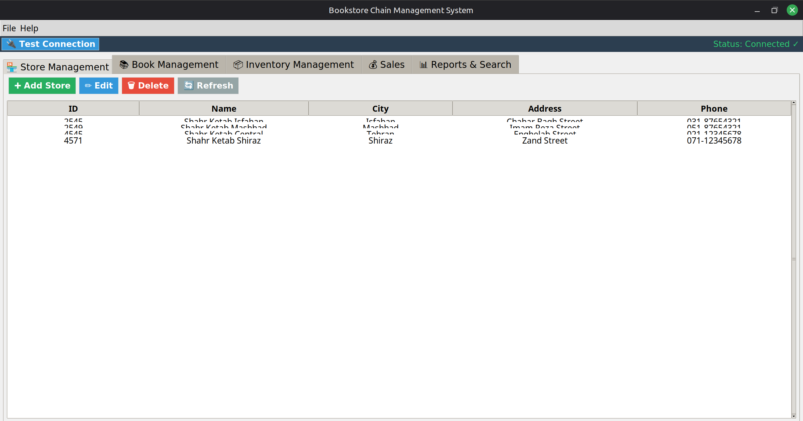
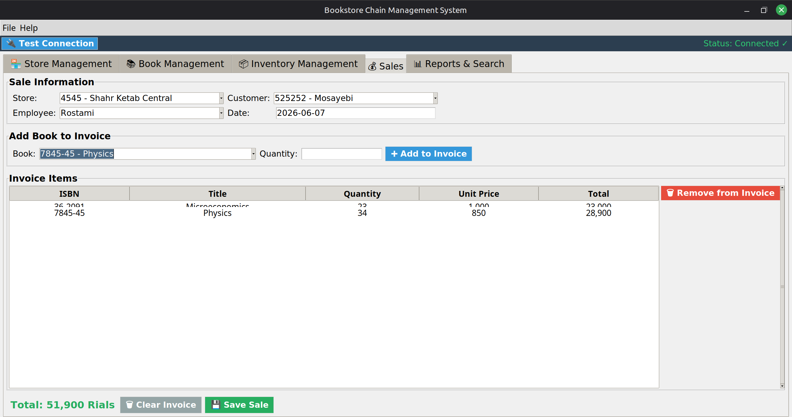
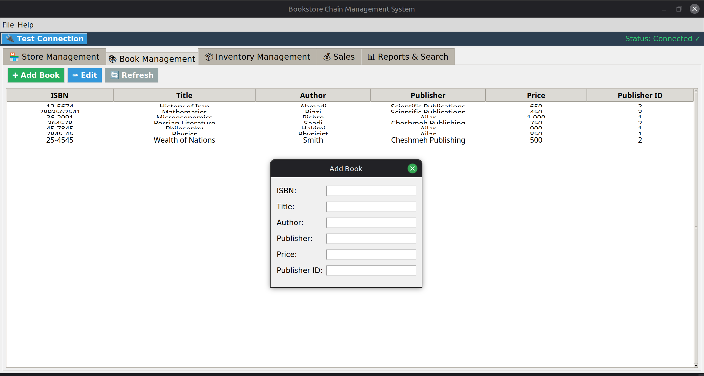

# Book Management System

A simple and lightweight book management system built with [Python / Django / Flask / etc. – adjust as needed].

## Features

- Add, edit, and delete books
- Search by title, author, or publication year
- Display books in a sortable table
- Persistent storage using a database (SQLite / PostgreSQL)

## Screenshots

| Home | Add Book | Search | Book List |
|------|----------|--------|------------|
|  |  |  |  |

Or in a row:

   

## How to Run

```bash
# Clone the repository
git clone https://github.com/mahdirostami2004/book_management_system.git
cd book_management_system

# Install dependencies (if any)
pip install -r requirements.txt

# Run the application
python src/main.py   # adjust according to your project structure