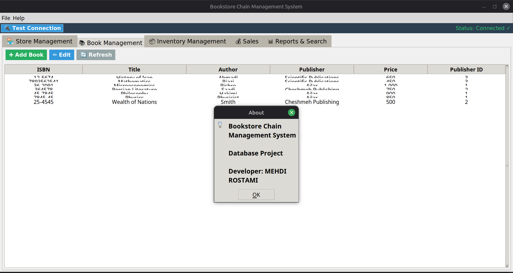

# Book Management System

A simple and lightweight book management system built with Python, SQLite, and Tkinter.

## Features

- Add, Edit, Delete Books – Full CRUD operations
- Search by Title or Author
- Persistent SQLite3 database
- User-friendly Tkinter GUI
- Sales & Store Management modules

## Screenshots

**About / Info**  


**Book Management**  


**Sales Dashboard**  


**Store Management**  


## How to Run

```bash
git clone https://github.com/mahdirostami2004/book_management_system.git
cd book_management_system
pip install -r requirements.txt   # (no external deps)
python src/main.py
